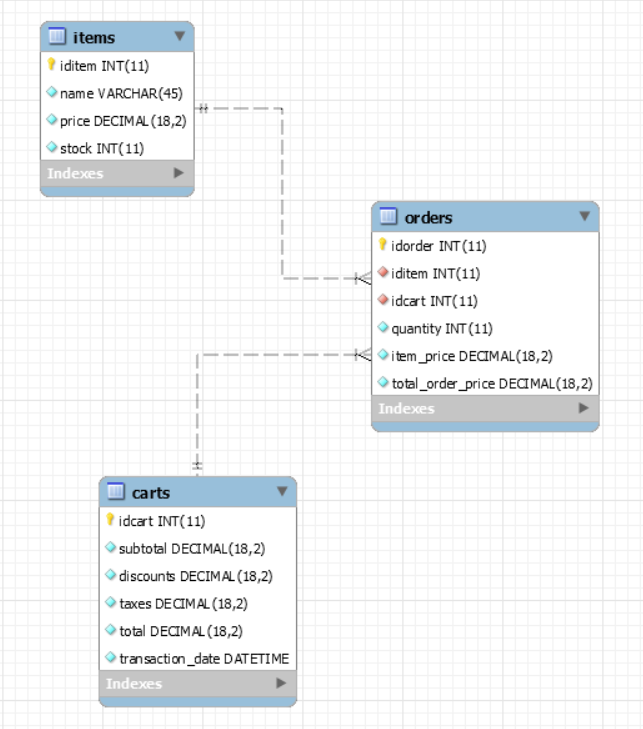
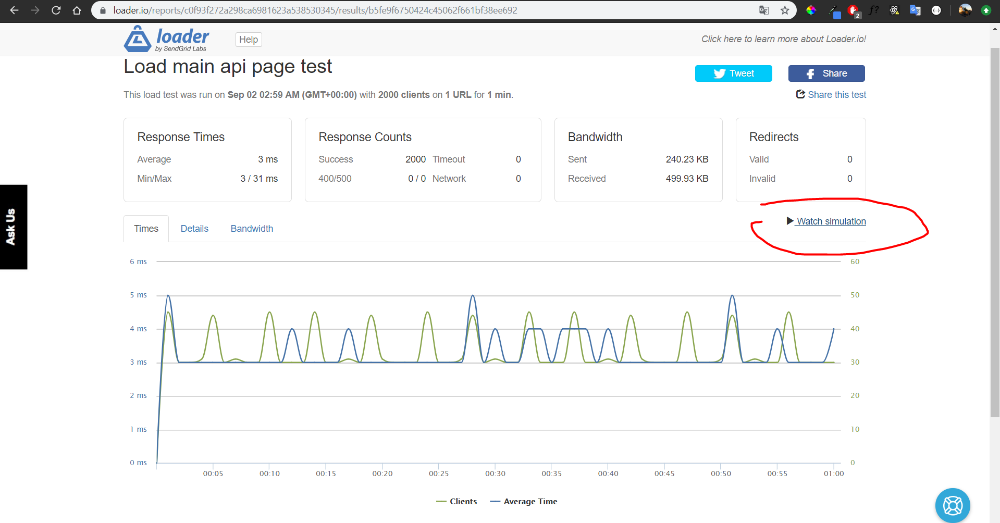

# NodeJS-API

This project was created using [Node](https://nodejs.org/en/) version 10.16.3 and [MySQL](https://www.mysql.com) version 5.5.62, it also    makes use of some npm packages like [express](https://www.npmjs.com/package/express) version 4.17.1, [body-parser](https://www.npmjs.com/package/body-parser) version 1.19.0 and [mysql](https://www.npmjs.com/package/mysql) version 2.17.1.

## Database

The database is stablished under [MySQL](https://www.mysql.com) version 5.5.62, It uses the next schema:



You can generate the DB using the next script:

```
-- MySQL Script created for DB generation
-- Mon Sep  2 01:03:21 2019
-- Model: New Model    Version: 1.0

SET @OLD_UNIQUE_CHECKS=@@UNIQUE_CHECKS, UNIQUE_CHECKS=0;
SET @OLD_FOREIGN_KEY_CHECKS=@@FOREIGN_KEY_CHECKS, FOREIGN_KEY_CHECKS=0;
SET @OLD_SQL_MODE=@@SQL_MODE, SQL_MODE='ONLY_FULL_GROUP_BY,STRICT_TRANS_TABLES,NO_ZERO_IN_DATE,NO_ZERO_DATE,ERROR_FOR_DIVISION_BY_ZERO,NO_ENGINE_SUBSTITUTION';

-- -----------------------------------------------------
-- Schema mydb
-- -----------------------------------------------------
-- -----------------------------------------------------
-- Schema heroku_99ecfa2d2c08fa4
-- -----------------------------------------------------
DROP SCHEMA IF EXISTS `heroku_99ecfa2d2c08fa4` ;

-- -----------------------------------------------------
-- Schema heroku_99ecfa2d2c08fa4
-- -----------------------------------------------------
CREATE SCHEMA IF NOT EXISTS `heroku_99ecfa2d2c08fa4` DEFAULT CHARACTER SET utf8 ;
USE `heroku_99ecfa2d2c08fa4` ;

-- -----------------------------------------------------
-- Table `heroku_99ecfa2d2c08fa4`.`carts`
-- -----------------------------------------------------
DROP TABLE IF EXISTS `heroku_99ecfa2d2c08fa4`.`carts` ;

CREATE TABLE IF NOT EXISTS `heroku_99ecfa2d2c08fa4`.`carts` (
  `idcart` INT(11) NOT NULL AUTO_INCREMENT,
  `subtotal` DECIMAL(18,2) NOT NULL,
  `discounts` DECIMAL(18,2) NOT NULL,
  `taxes` DECIMAL(18,2) NOT NULL,
  `total` DECIMAL(18,2) NOT NULL,
  `transaction_date` DATETIME NOT NULL,
  PRIMARY KEY (`idcart`))
ENGINE = InnoDB
AUTO_INCREMENT = 52
DEFAULT CHARACTER SET = utf8;


-- -----------------------------------------------------
-- Table `heroku_99ecfa2d2c08fa4`.`items`
-- -----------------------------------------------------
DROP TABLE IF EXISTS `heroku_99ecfa2d2c08fa4`.`items` ;

CREATE TABLE IF NOT EXISTS `heroku_99ecfa2d2c08fa4`.`items` (
  `iditem` INT(11) NOT NULL AUTO_INCREMENT,
  `name` VARCHAR(45) NOT NULL,
  `price` DECIMAL(18,2) NOT NULL,
  `stock` INT(11) NOT NULL,
  PRIMARY KEY (`iditem`),
  UNIQUE INDEX `iditem_UNIQUE` (`iditem` ASC) VISIBLE)
ENGINE = InnoDB
AUTO_INCREMENT = 192
DEFAULT CHARACTER SET = utf8;


-- -----------------------------------------------------
-- Table `heroku_99ecfa2d2c08fa4`.`orders`
-- -----------------------------------------------------
DROP TABLE IF EXISTS `heroku_99ecfa2d2c08fa4`.`orders` ;

CREATE TABLE IF NOT EXISTS `heroku_99ecfa2d2c08fa4`.`orders` (
  `idorder` INT(11) NOT NULL AUTO_INCREMENT,
  `iditem` INT(11) NOT NULL,
  `idcart` INT(11) NOT NULL,
  `quantity` INT(11) NOT NULL,
  `item_price` DECIMAL(18,2) NOT NULL,
  `total_order_price` DECIMAL(18,2) NOT NULL,
  PRIMARY KEY (`idorder`),
  UNIQUE INDEX `idorders_UNIQUE` (`idorder` ASC) VISIBLE,
  INDEX `iditem_idx` (`iditem` ASC) VISIBLE,
  INDEX `idcart_idx` (`idcart` ASC) VISIBLE,
  CONSTRAINT `idcart`
    FOREIGN KEY (`idcart`)
    REFERENCES `heroku_99ecfa2d2c08fa4`.`carts` (`idcart`)
    ON DELETE NO ACTION
    ON UPDATE NO ACTION,
  CONSTRAINT `iditem`
    FOREIGN KEY (`iditem`)
    REFERENCES `heroku_99ecfa2d2c08fa4`.`items` (`iditem`)
    ON DELETE NO ACTION
    ON UPDATE NO ACTION)
ENGINE = InnoDB
AUTO_INCREMENT = 52
DEFAULT CHARACTER SET = utf8;


SET SQL_MODE=@OLD_SQL_MODE;
SET FOREIGN_KEY_CHECKS=@OLD_FOREIGN_KEY_CHECKS;
SET UNIQUE_CHECKS=@OLD_UNIQUE_CHECKS;

```

## Development server

The development server is running on a heroku instance at `https://blackthorn-api.herokuapp.com/`.

## Endpoints

The endpoints of the api are based in 3 resources: items, orders, and carts. All of them have the mainly http methods used for CRUDS:

### Items
- Get all the items `https://blackthorn-api.herokuapp.com/api/items`
- Get item by id `https://blackthorn-api.herokuapp.com/api/items/{id}`
- Create a new item `https://blackthorn-api.herokuapp.com/api/items`
  
  JSON object
    ```
  { 
    "name": string,
    "price": decimal,
    "stock": integer
  }
   ```
  
  e.g.
  
  ```
  { 
    "name": "Alcohol",
    "price": 5.5,
    "stock": 100
  }
   ```
- Delete an item `https://blackthorn-api.herokuapp.com/api/items/{id}`
- Update an item `https://blackthorn-api.herokuapp.com/api/items`
  
  JSON object
    ```
  { 
    "iditem": integer,
    "name": string,
    "price": decimal,
    "stock": integer
  }
   ```
  
  e.g.
  
  ```
  { 
    "iditem": 182,
    "name": "Alcohol",
    "price": 5.5,
    "stock": 100
  }
   ```

### Carts
- Get all the carts `https://blackthorn-api.herokuapp.com/api/carts`
- Get cart by id `https://blackthorn-api.herokuapp.com/api/carts/{id}`
- Create a new cart `https://blackthorn-api.herokuapp.com/api/carts`
  
  JSON object
    ```
  { 
    "subtotal": decimal,
	  "discounts": decimal,
	  "taxes": decimal,
	  "total": decimal,
	  "transaction_Date": datetime
  }
   ```
  
  e.g.
  
  ```
  { 
    "subtotal": 50.00,
    "discounts": 5.00,
    "taxes": 3.00,
    "total": 57.00,
    "transaction_Date": "2019-09-01T05:31:09Z"
  }
   ```
- Delete a cart `https://blackthorn-api.herokuapp.com/api/carts/{id}`
- Update a cart `https://blackthorn-api.herokuapp.com/api/carts`
  
  JSON object
    ```
  { 
    "idcart": integer,
    "subtotal": decimal,
	  "discounts": decimal,
	  "taxes": decimal,
	  "total": decimal,
	  "transaction_Date": datetime
  }
   ```
  
  e.g.
  
  ```
  { 
    "idcart": 42,
    "subtotal": 50.00,
    "discounts": 5.00,
    "taxes": 3.00,
    "total": 57.00,
    "transaction_Date": "2019-09-01T05:31:09Z"
  }
   ```

### Orders
- Get all the orders `https://blackthorn-api.herokuapp.com/api/orders`
- Get order by id `https://blackthorn-api.herokuapp.com/api/orders/{id}`
- Create a new order `https://blackthorn-api.herokuapp.com/api/orders`
  
  JSON object
    ```
  { 
    "iditem": integer,
    "idcart": integer,
    "quantity": integer,
    "item_price": decimal,
    "total_order_price": decimal
  }
   ```
  
  e.g.
  
  ```
  { 
    "iditem": 42,
    "idcart": 12,
    "quantity": 8,
    "item_price": 0.25,
    "total_order_price": 2.00
  }
   ```
- Delete an order `https://blackthorn-api.herokuapp.com/api/orders/{id}`
- Update an order `https://blackthorn-api.herokuapp.com/api/orders`
  
  JSON object
    ```
  { 
    "idorder": integer,
    "iditem": integer,
    "idcart": integer,
    "quantity": integer,
    "item_price": decimal,
    "total_order_price": decimal
  }
   ```
  
  e.g.
  
  ```
  { 
    "idorder": 12,
    "iditem": 42,
    "idcart": 12,
    "quantity": 8,
    "item_price": 0.25,
    "total_order_price": 2.00
  }
   ```
Also there is an endpoint available for looking a text file in the api that is `https://blackthorn-api.herokuapp.com/loaderio-f6ce126d6f59b2c5449979d6489a3a15.txt`, but that one is related to the loader.io add-on from heroku for testing the concurrency of users.

## Testing

Using the tool loader.io from heroku, some concurrency test where made to the api endpoints. Each of them took ***one minute and a maintained client load between 1500 and 2000*** as you can see in the next links:
 - Load main api page test - https://ldr.io/2liCfHO
 - Get items test - https://ldr.io/2MQLgV9
 - Get orders test - https://ldr.io/2MOe14E
 - Get carts test - https://ldr.io/2lQzr52
 - Get item by id test - https://ldr.io/2liY89U
 - Get order by id test - https://ldr.io/2lGPlPe
 - Get cart by id test - https://ldr.io/2jO4JJ2
 
 You can simulate each one of the test by going to the above links and clicking **Watch simulation** as you can see in the next image:


